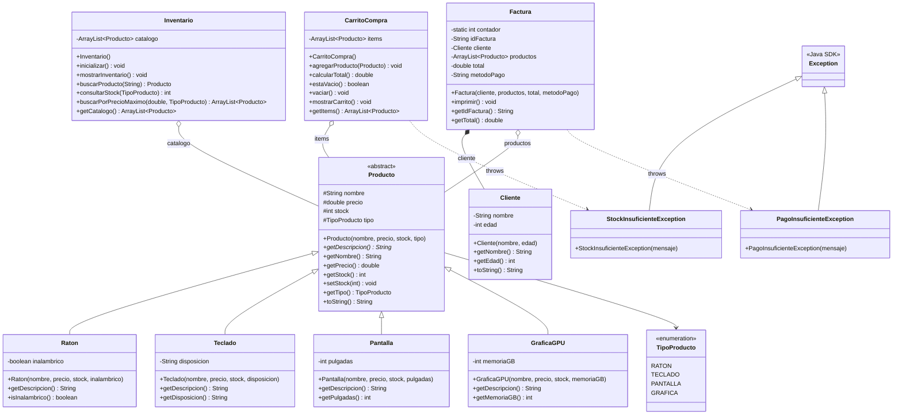

# Diagrama UML — Tienda de Tecnología

```mermaid
classDiagram

    class TipoProducto {
        <<enumeration>>
        RATON
        TECLADO
        PANTALLA
        GRAFICA
    }

    class Producto {
        <<abstract>>
        #String nombre
        #double precio
        #int stock
        #TipoProducto tipo
        +Producto(nombre, precio, stock, tipo)
        +getDescripcion() String*
        +getNombre() String
        +getPrecio() double
        +getStock() int
        +setStock(int) void
        +getTipo() TipoProducto
        +toString() String
    }

    class Raton {
        -boolean inalambrico
        +Raton(nombre, precio, stock, inalambrico)
        +getDescripcion() String
        +isInalambrico() boolean
    }

    class Teclado {
        -String disposicion
        +Teclado(nombre, precio, stock, disposicion)
        +getDescripcion() String
        +getDisposicion() String
    }

    class Pantalla {
        -int pulgadas
        +Pantalla(nombre, precio, stock, pulgadas)
        +getDescripcion() String
        +getPulgadas() int
    }

    class GraficaGPU {
        -int memoriaGB
        +GraficaGPU(nombre, precio, stock, memoriaGB)
        +getDescripcion() String
        +getMemoriaGB() int
    }

    class Cliente {
        -String nombre
        -int edad
        +Cliente(nombre, edad)
        +getNombre() String
        +getEdad() int
        +toString() String
    }

    class CarritoCompra {
        -ArrayList~Producto~ items
        +CarritoCompra()
        +agregarProducto(Producto) void
        +calcularTotal() double
        +estaVacio() boolean
        +vaciar() void
        +mostrarCarrito() void
        +getItems() ArrayList~Producto~
    }

    class Factura {
        -static int contador
        -String idFactura
        -Cliente cliente
        -ArrayList~Producto~ productos
        -double total
        -String metodoPago
        +Factura(cliente, productos, total, metodoPago)
        +imprimir() void
        +getIdFactura() String
        +getTotal() double
    }

    class Inventario {
        -ArrayList~Producto~ catalogo
        +Inventario()
        +inicializar() void
        +mostrarInventario() void
        +buscarProducto(String) Producto
        +consultarStock(TipoProducto) int
        +buscarPorPrecioMaximo(double, TipoProducto) ArrayList~Producto~
        +getCatalogo() ArrayList~Producto~
    }

    class StockInsuficienteException {
        +StockInsuficienteException(mensaje)
    }

    class PagoInsuficienteException {
        +PagoInsuficienteException(mensaje)
    }

    class Exception {
        <<Java SDK>>
    }

    %% Herencia de Producto
    Producto <|-- Raton
    Producto <|-- Teclado
    Producto <|-- Pantalla
    Producto <|-- GraficaGPU

    %% Herencia de excepciones
    Exception <|-- StockInsuficienteException
    Exception <|-- PagoInsuficienteException

    %% Dependencia: Producto usa TipoProducto
    Producto --> TipoProducto

    %% Agregacion: colecciones de Producto
    CarritoCompra o-- Producto : items
    Inventario o-- Producto : catalogo

    %% Composicion: Factura contiene Cliente y snapshot de productos
    Factura *-- Cliente : cliente
    Factura o-- Producto : productos

    %% Dependencias de uso
    CarritoCompra ..> StockInsuficienteException : throws
    Factura ..> PagoInsuficienteException : throws
```
